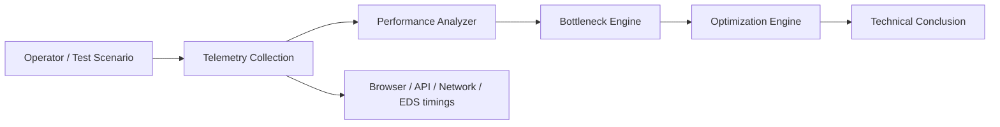

# Procurement Performance Analyzer

> Demonstration MVP for instrumental analysis and optimization of the electronic procurement application-submission process.

## Purpose

The prototype demonstrates the first stage of a technical performance audit: decompose a submission workflow into measurable operations, identify bottlenecks, and model optimization hypotheses.

**Methodology:** `Baseline → Instrumentation → Bottleneck Analysis → Optimization → Benchmark → Technical Conclusion`

## What the MVP demonstrates

- process decomposition into measurable stages;
- baseline duration and bottleneck ranking;
- contribution of each operation to total execution time;
- classification of operations by browser, backend, network, data and EDS/cryptography;
- identification of blocking and potentially parallelizable operations;
- demonstration-only optimization hypotheses;
- JSON API for submitting a custom benchmark;
- interactive web interface and Swagger/OpenAPI documentation.

## Architecture concept



## Demo

The included scenario is synthetic and is intended to demonstrate the analysis pipeline. It is **not** a measurement of any production procurement platform.

The current demo does not connect to a procurement platform and does not perform real application submission.

## Run locally

```bash
python -m venv .venv

# Windows
.venv\\Scripts\\activate

# Linux/macOS
source .venv/bin/activate

pip install -r requirements.txt
uvicorn app:app --reload
```

Open `http://127.0.0.1:8000`.

Dashboard: `http://127.0.0.1:8000/dashboard`

Swagger/OpenAPI: `http://127.0.0.1:8000/docs`

## API

- `GET /health` — service health check
- `GET /api/demo` — synthetic benchmark and analysis
- `POST /api/analyze` — analyze a supplied benchmark

## From MVP to production audit

The next implementation layer is instrumentation of an **authorized test scenario** using permitted platform interaction mechanisms. Candidate telemetry includes:

- DNS, TCP/TLS and HTTP timings;
- request/response sizes, retries and timeouts;
- API call sequence and dependencies;
- document preparation and upload timings;
- EDS data preparation and cryptographic operation timings;
- server-side processing time where the platform exposes an observable timestamp;
- repeated runs with min/median/average/P95/max statistics.

## Security and compliance boundary

The prototype intentionally contains no mechanisms for bypassing CAPTCHA, authentication, authorization, rate limits, anti-bot controls or other platform protections.

A production implementation should use only the procurement platform's official APIs, documented integration mechanisms, browser workflows available to an authorized user, and other explicitly permitted interaction methods.

## Important limitation

The optimization coefficients in `optimize()` are **illustrative hypotheses only**. They must be replaced by measured values and validated through controlled benchmark runs before any performance target is stated.

## Project structure

```text
.
├── app.py
├── requirements.txt
├── sample_benchmark.json
└── docs/
    ├── architecture.md
    ├── demo.md
    └── methodology.md
```

## License

MIT — see `LICENSE`.
