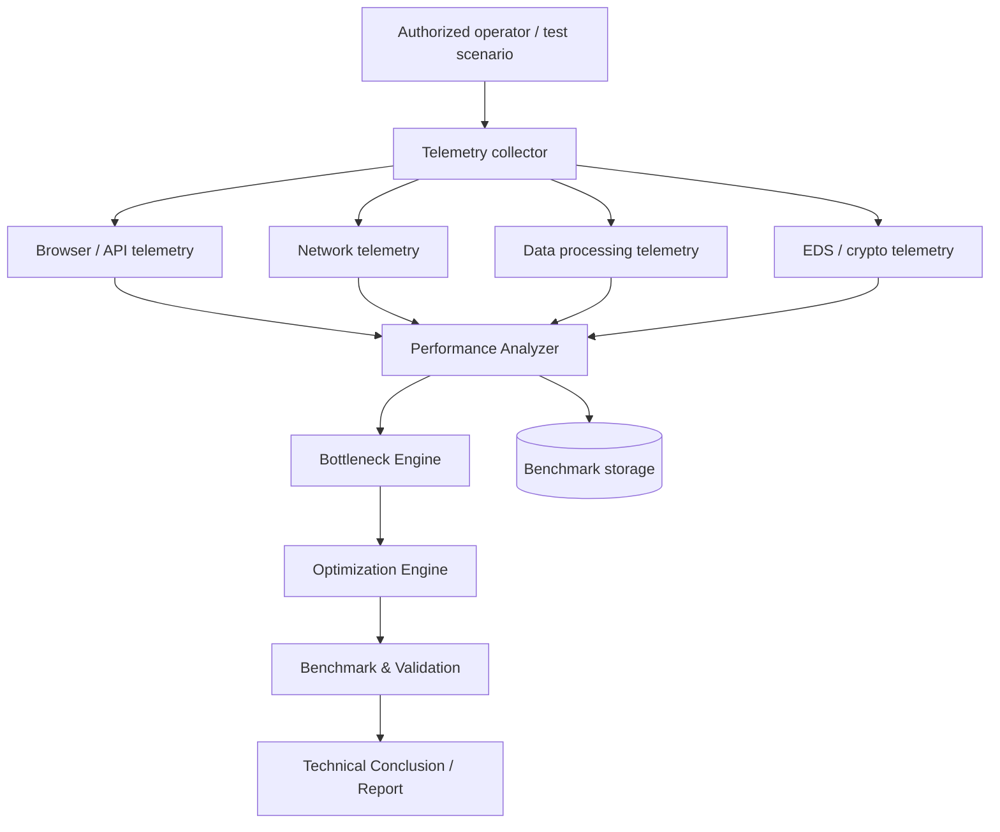

# Target Architecture

## Components

### Telemetry Collector
Captures timing data from an authorized and reproducible test scenario.

### Performance Analyzer
Normalizes events into a common timeline and calculates stage durations and statistical metrics.

### Bottleneck Engine
Ranks operations by contribution to total execution time and detects sequential dependencies and candidate parallelization opportunities.

### Optimization Engine
Maps observed patterns to optimization hypotheses. It does not assume that an optimization is technically or contractually permitted until validated.

### Benchmark & Validation
Runs repeatable before/after measurements and produces comparable statistics.

### Technical Conclusion
Documents the bottlenecks, constraints, optimization options, measured effect and recommended target architecture.
